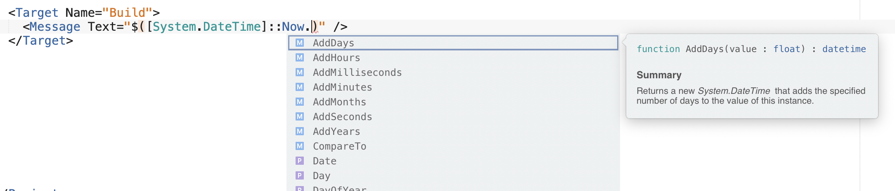

# MonoDevelop.MSBuildEditor

The MSBuild Editor extension provides improved support for editing MSBuild files in Visual Studio and Visual Studio for Mac.
It can be installed from the Extension Manager.

## Features

### IntelliSense

MSBuild-specific IntelliSense helps you write your project and target files, with rich contextual completion for MSBuild elements, attributes and expressions.

The completion for `PackageReference` attributes queries NuGet.org as you type.

There's completion for condition comparisons:

And there's also completion for property functions:

### Navigation

You can use the *Go to Definition* command or *Command*-click to navigate to any import, SDK or filename. If an import has multiple valid ways it can be evaluated, you can navigate to any of them. When navigating to an SDK, you can navigate to any of the `.props` and `.targets` in it.

The *Find References* command can accurately and precisely find all references to items, properties, metadata and tasks throughout your project and its imports.

If you have "Highlight Identifiers" feature enabled, it'll work for MSBuild files too.

### Imports

The extension resolves your project's imports recursively, and scans all the found MSBuild files for items, properties, metadata, targets and tasks to be included in IntelliSense and *Find References*. It attempts to resolve imports as broadly as possible, ignoring conditions and checking multiple values. It also has full support for SDKs that are resolved via SDK resolvers.

### Tooltips

Tooltips for items, properties and metadata allow you to see their descriptions and expected value types, and see which imports they have been referenced in.

Tooltips for imports and SDKs show you the paths of the imported files.

### Schemas

In addition to the schema inferred from the items, metadata, properties and tasks used in a project's imports, the extension also defines a schema format for describing them in more detail. The IntelliSense system uses these to provide a richer editing and validation experience.

Targets can provide a schema 'sidecar', which has the same name as the targets file except with the suffix `.buildschema.json`.

The extension includes built-in schemas for `Microsoft.Common.targets` and other common targets.

### Validation

The editor validates your document against the MSBuild language and schema, and shows these errors and warnings as you type.

### Documentation

The extension includes documentation tooltips for the MSBuild language and many common items, properties and metadata.

### Formatting Style

The extension adds a formatting policy for MSBuild files, allowing you to customize the formatting behaviour. The default formatting policy uses two spaces for indentation, matching the project files created by Visual Studio.

## Installationn

Currently there only CI builds which you can get from [GitHub Actions tab](https://github.com/mhutch/MonoDevelop.MSBuildEditor/actions)

## Development

See the [TODO](TODO.md) for a list of proposed/planned features. If you're interested in implementing one of them please contact Mikayla.
