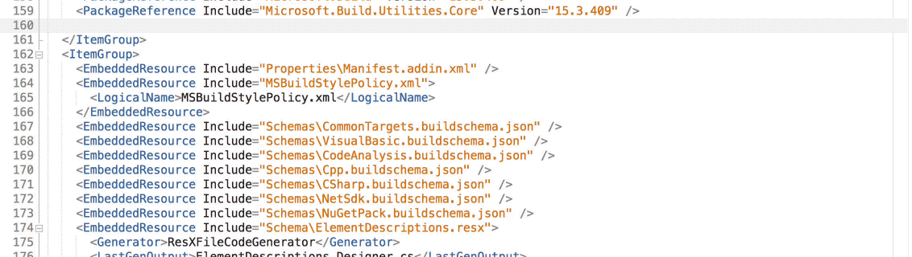
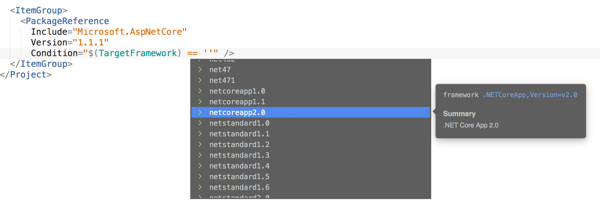
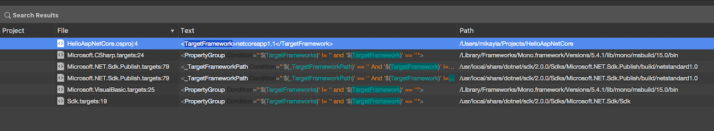
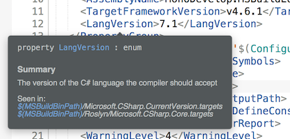
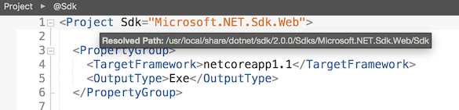
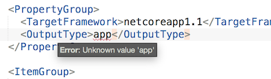

# MonoDevelop.MSBuildEditor

The MSBuild Editor extension provides improved support for editing MSBuild files in MonoDevelop.

## Features

### IntelliSense

MSBuild-specific IntelliSense helps you write your project and target files, with rich contextual completion for MSBuild elements, attributes and expressions.

The completion for `PackageReference` attributes queries NuGet.org as you type.

There's even completion for condition comparisons.

### Navigation

The *Go to Definition* command can be used to navigate to an import or an SDK. If the import has multiple valid ways it can be evaluated, you can navigate to any of them. When navigating to an SDK, you can navigate to any of the `.props` and `.targets` in it.

The *Find References* command can accurately and precisely find all references to items, properties, metadata and tasks throughout your project and its imports.

### Imports

The extension resolves your project's imports recursively, and scans all the found MSBuild files for items, properties, metadata, targets and tasks to be included in IntelliSense and *Find References*. It attempts to resolve imports as broadly as possible, ignoring conditions and checking multiple values. It also has full support for SDKs that are resolved via SDK resolvers.

### Tooltips

Tooltips for items, properties and metadata allow you to see their descriptions and expected value types, and see which imports they have been referenced in.

Tooltips for imports and SDKs show you the paths of the imported files.

### Schemas

In addition to the schema inferred from the items, metadata, properties and tasks used in a project's imports, the extension also defines a schema format for describing them in more detail. The IntelliSense system uses these to provide a richer editing and validation experience.

Targets can provide a schema 'sidecar', which has the same name as the targets file except with the suffix `.buildschema.json`.

The extension includes built-in schemas for `Microsoft.Common.targets` and other common targets.

### Validation

The editor validates your document against the MSBuild language and schema, and shows these errors and warnings as you type.

### Documentation

The extension includes documentation tooltips for the MSBuild language and many common items, properties and metadata.

### Formatting Style

The extension adds a formatting policy for MSBuild files, allowing you to customize the formatting behaviour. The default formatting policy uses two spaces for indentation, matching the project files created by Visual Studio.

## TODO

The following feature are not yet implemented. Please contact Mikayla if you are interested in helping out.

* Port to Visual Studio for Windows
* Snippets
* Add more unit tests
* Add logic to figure out context of unqualified metadata
* In addition to brute forcing imports, resolve using full conditioned state
* Write a json schema for the schema
* Completion for metadata and property functions in expressions
* Implement completion for more item and value types
* Completion of inline C#
* show default value of property/metadata/items in tooltips
* error when assigning values to reserved properties and metadata
* parameter info tooltip when completing values
* go to package page command on nugets
* prettier package tooltips
* filter disallowed and existing attributes and elements from completion
* property comparand validation
* validate metadata refs are valid in context
* use new expression parser for triggering intellisense
  for example when multivalued language imports cause
  multiple imports of common targets
* project kind completion
* Include.Project filename completion should be relative to SDK, if any
* support encoding all over
* syntax highlighting for property functions, item functions, transforms and conditions
* better highlighting colors - the default MD theme doesn't define many we can use, but other themes have more
* trigger intellisense on |, indexed against | separated comparands
* support property functions, item functions in new expression parser
* validate property/items types passed to/from task parameters
* add documentation for task parameters
* fix some of the [FIXMEs](https://github.com/mhutch/MonoDevelop.MSBuildEditor/search?utf8=%E2%9C%93&q=fixme&type=)