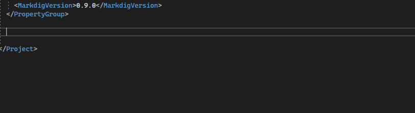
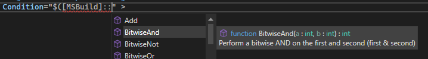
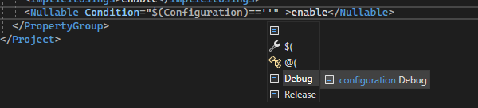
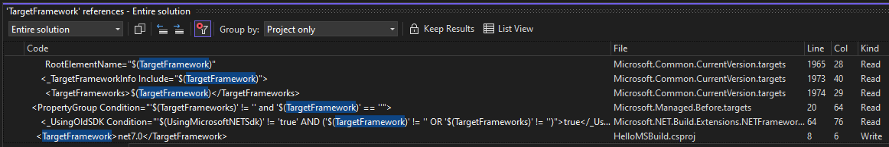
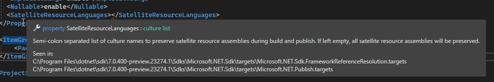
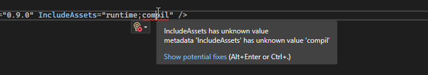
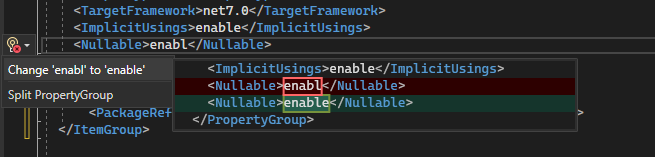
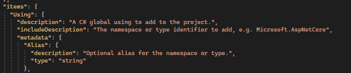

# MonoDevelop.MSBuildEditor

MSBuild Editor is an open-source language service that provides enhanced support for editing MSBuild files in Visual Studio. It includes IntelliSense, Quick Info, navigation, validation, code fixes, and refactorings, all driven by a powerful and customizable schema-based type system.

You can install the extension from the Visual Studio Extension Manager or from the [Visual Studio Marketplace](https://marketplace.visualstudio.com/items?itemName=mhutch.msbuildeditor), download a [CI build](https://github.com/mhutch/MonoDevelop.MSBuildEditor/actions), or build from source.
  

**⚠️ The editor is currently in preview. 
📝 Please report bugs and feature requests in the GitHub repo. 
🎉 Pull requests are also much appreciated!**
 

**Please let us know about your experience by filling out [this survey](https://www.surveymonkey.com/r/G3F9SC3)**.
  

We appreciate your feedback, and it will help guide how the experiment develops and whether the MSBuild Editor becomes an officially supported part of the .NET development experience.

*For an explanation of why the repo and assembly names contains "MonoDevelop", see [this discussion post](https://github.com/mhutch/MonoDevelop.MSBuildEditor/discussions/197#discussioncomment-9098580).*

## Development

Bugs and proposed features are tracked in [GitHub issues](issues), though some older items have not yet been migrated from the [TODO](TODO.md). If you're interested in implementing a feature or fixing a bug and have any questions at all, please cc @mhutch on a comment on the appropriate new or existing GitHub issue.

## Features

### IntelliSense

MSBuild-specific IntelliSense helps you write your project and target files, with rich contextual completion for MSBuild elements, attributes and expressions. The completion for `PackageReference` attributes queries NuGet.org as you type, and provides completion for package names and package versions.

There's completion for MSBuild expressions, including condition comparisons, property functions and item functions. The editor also supports *Expand Selection* within MSBuild expressions.

### Navigation

You can use the *Go to Definition* command or *Ctrl-Click* to navigate to any import, SDK or filename. If an import has multiple valid ways it can be evaluated, you can navigate to any of them. When navigating to an SDK, you can navigate to any of the `.props` and `.targets` in it.

The *Find References* command can accurately and precisely find all references to items, properties, metadata and tasks throughout your project and its imports, including in expressions.

### Quick Info

Quick Info tooltips for items, properties, metadata and values allow you to see their descriptions and expected value types, and see which imports they have been referenced in. Tooltips for imports and SDKs show you the paths of the imported files.

### Validation and Analyzers

The editor validates your document against the MSBuild language and any imported schemas, and shows these errors and warnings as you type.

The core validator performs several other diagnostics such as warning about unused symbols, and there is a Roslyn-like analyzer mechanism, and examples of current built-in analyzers include:

* Package references should only pivot on target framework
* Use `<TargetFramework>` instead of `<TargetFrameworks>` when there is a single value, and vice versa

### Code Fixes and Refactorings

The editor supports code fixes for several diagnostics, and has refactorings such as *Extract Expression*.

### Schema-driven Type System

In addition to the schema inferred from the items, metadata, properties and tasks used in a project's imports, the extension also defines a json-based MSBuild-specific schema format that can be used to provide documentation, type annotations, allowed values, and other information that is used to provide a richer editing and validation experience.

Any targets file can provide a schema 'sidecar', which has the same name as the targets file except with the suffix `.buildschema.json`. The editor will load the sidecar schemas for any targets that it imports. This allows MSBuild targets to provide their own documentation.

The wiki contains [guidance on creating custom schemas](https://github.com/mhutch/MonoDevelop.MSBuildEditor/wiki/Creating-a-custom-schema) and documents the [schema format](https://github.com/mhutch/MonoDevelop.MSBuildEditor/wiki/Schema-structure).

The extension includes built-in schemas for `Microsoft.Common.targets`, `Microsoft.NET.Sdk`, and other common targets and MSBuild SDKs.

### Broad Import Model

The extension resolves your project's imports recursively, and scans all the found MSBuild files for items, properties, metadata, targets and tasks to be included in IntelliSense and *Find References*. It attempts to resolve imports as broadly as possible so that IntelliSense and navigation are not dependent on the current evaluated state of your project. It ignoring conditions on imports and attempts to evaluate them with multiple property values. It also has full support for SDKs that are resolved via SDK resolvers.

## Privacy Statement

The extension has telemetry that sends anonymized error traces and usage information to the publisher of the extension. This information is used to help improve the extension. The extension's telemetry is enabled when Visual Studio's telemetry is enabled, but you can explicitly opt out. For details, see the [full privacy statement](docs/PrivacyStatement.md).